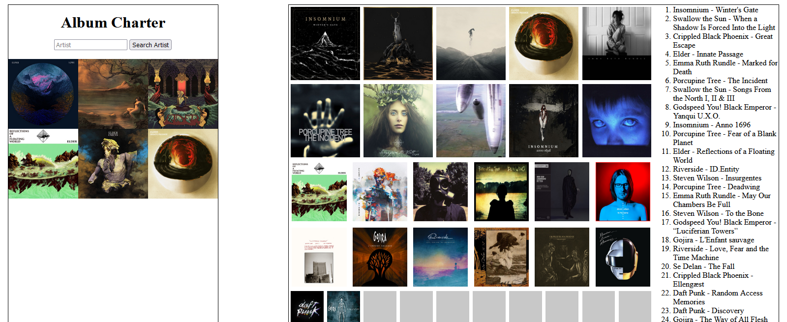
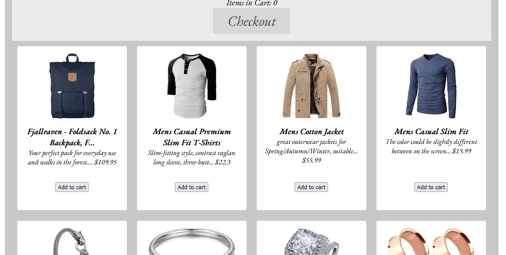

# CodeSchool2022-Class

## Content

This repository serves as the curriculum and content taught for the Front End half of Utah Tech University Code School '22.
The overall goal of this curriculum was to teach Vue2. At the end of the two weeks, Vuetify was introduced as a quick extra topic.

## File Organization

Each folder labeled `Day-x` contains the work done during that day.

The other two folders, `Component-Introduction` and `Veutify-Introduction`, contain small extra lessons that served as quick dives into those respective topics.

Forum application source can be found [here](https://github.com/derja12/CodeSchool2022-Forum-App/), and Webstore application source can be found [here](https://github.com/derja12/CodeSchool2022-Webstore-App).

## Examples

Album Charter (Days 2-3)

Webstore application (Days 6-7)

